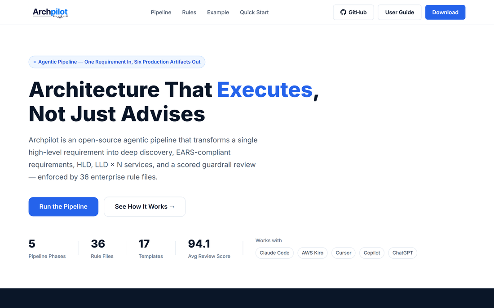
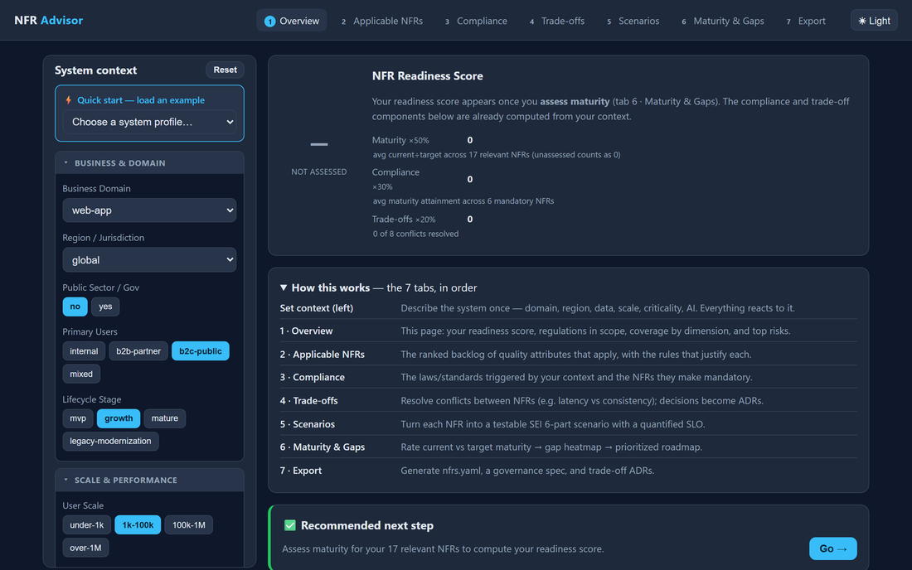
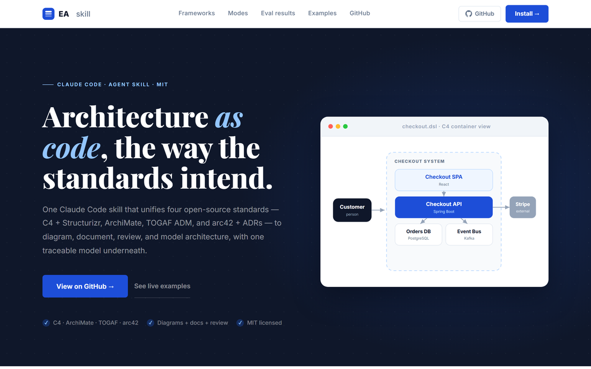
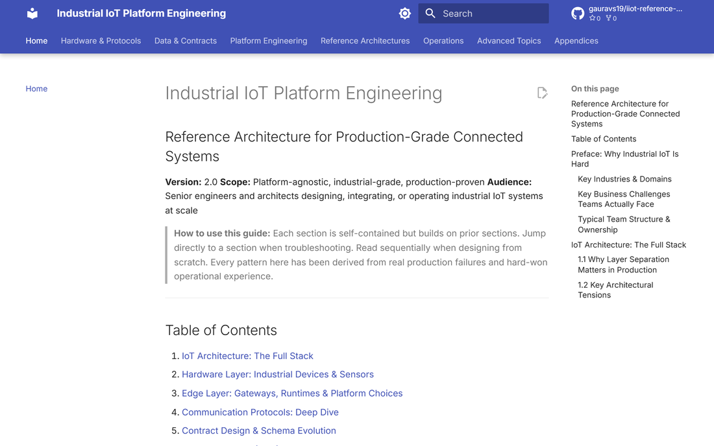
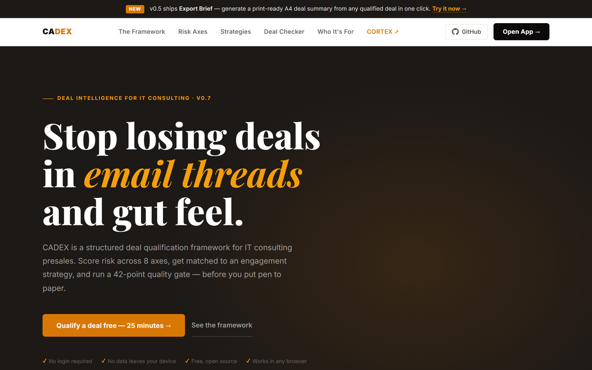
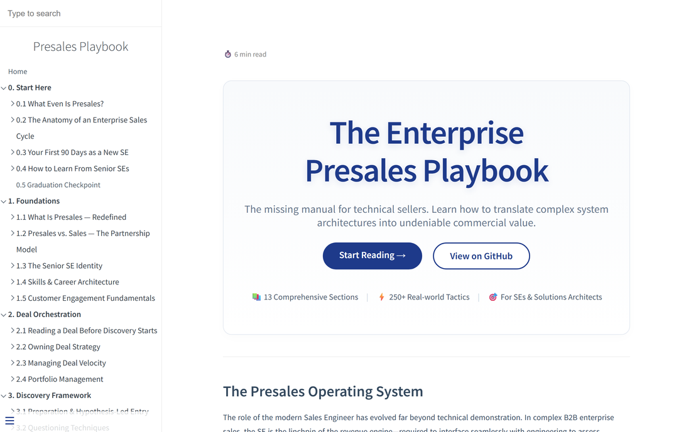
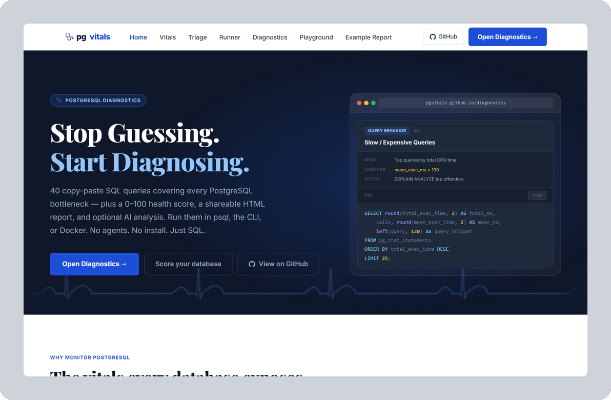

# Gaurav Sharma

**Solutions Architect & Engineering Leader.** I turn complex business problems into resilient, cost-optimized platforms — and I build the tools that make good architecture repeatable.

Eighteen-plus years across financial services, payments, data platforms, and industrial IoT. I design cloud-native, event-driven systems that hold up at real scale — 100K+ connected devices, 300K+ managed assets, millions of events an hour — and take them end to end, from CXO discovery workshops to production SLAs, with delivery across the US, UK, and Japan.

### How I work

- **Architecture should execute, not just advise.** A model that can't become requirements, code, and a review gate is an opinion, not a design.
- **Cost is a quality attribute.** Build-vs-buy, FinOps, and TCO belong in the architecture, not the invoice.
- **The non-functionals *are* the design.** Scalability, availability, fault tolerance, and observability decide whether a system survives production.
- **Domain before framework.** Clear bounded contexts age better than clever technology.

### Currently exploring

Agentic AI for architecture and delivery, LLM/RAG pipelines, and applied ML for predictive maintenance — and making enterprise-architecture practice more open, concrete, and tool-assisted.

**[Portfolio & case studies](https://gauravs19.github.io/portfolio/)**　·　**[CV](https://gauravs19.github.io/portfolio/Gaurav_Sharma_CV.pdf)**　·　**[LinkedIn](https://www.linkedin.com/in/gauravs19/)**

---

## Tools & field guides for enterprise architects

Most architecture guidance stops at the slide. I tend to build the opposite — small, open tools and concrete guides that turn principles into something you can run, score, and ship. Each one came out of a real gap in enterprise delivery: discovery, requirements, non-functionals, governance, observability, and presales.

<table>
  <tr align="center">
    <td width="25%"><a href="https://gauravs19.github.io/archpilot/"> <b>Archpilot</b></a> Requirement → HLD/LLD → scored review</td>
    <td width="25%"><a href="https://gauravs19.github.io/nfr-advisor/"> <b>NFR Advisor</b></a> Quality attributes, trade-offs & scenarios</td>
    <td width="25%"><a href="https://gauravs19.github.io/enterprise-architecture-skill/"> <b>EA Skill</b></a> C4 · ArchiMate · TOGAF · arc42, as code</td>
    <td width="25%"><a href="https://gauravs19.github.io/iiot-reference-architecture/"> <b>IIoT Reference Arch.</b></a> Edge-to-cloud industrial blueprint</td>
  </tr>
  <tr align="center">
    <td width="25%"><a href="https://gauravs19.github.io/cadex/"> <b>CADEX</b></a> Presales risk & deal qualification</td>
    <td width="25%"><a href="https://gauravs19.github.io/presales-playbook/"> <b>Presales Playbook</b></a> Translating architecture into value</td>
    <td width="25%"><a href="https://pgvitals.github.io/"> <b>pgvitals</b></a> PostgreSQL performance diagnostics</td>
    <td width="25%"></td>
  </tr>
</table>

---

## Selected work, by theme

<b>Architecture-as-code & governance</b>

 

| Project | What it is | |
|---|---|---|
| **[archpilot](https://github.com/gauravs19/archpilot)** ⭐8 | An agentic pipeline that takes a single requirement and produces deep discovery, EARS-compliant requirements, an HLD, an LLD per service, and a scored guardrail review — all enforced by 36 enterprise rule files. | [demo](https://gauravs19.github.io/archpilot/) |
| **[archpilot-reviewer](https://github.com/gauravs19/archpilot-reviewer)** ⭐2 | A GitHub Action that runs architecture governance on every pull request, flagging drift from your standards before it reaches `main`. | — |
| **[archpilot-cli](https://github.com/gauravs19/archpilot-cli)** | A command-line scaffolder that generates enterprise-architecture documents from the Archpilot standards library so teams start consistent. | — |
| **[enterprise-architecture-skill](https://github.com/gauravs19/enterprise-architecture-skill)** ⭐1 | A Claude Code skill that produces C4 + Structurizr, ArchiMate, TOGAF ADM, and arc42 artifacts — diagrams and decision records authored as code. | [demo](https://gauravs19.github.io/enterprise-architecture-skill/) |
| **[nfr-advisor](https://github.com/gauravs19/nfr-advisor)** | Takes a system's context, ranks the non-functional requirements that apply, surfaces the trade-offs between them, generates testable scenarios, and exports the result as code. | [demo](https://gauravs19.github.io/nfr-advisor/) |
| **[cadex](https://github.com/gauravs19/cadex)** | An eight-axis risk model for presales: qualify a deal, match an engagement strategy, and pass a 42-point quality gate before committing. | [demo](https://gauravs19.github.io/cadex/) |

<b>Applied AI & machine learning</b>

 

| Project | What it is |
|---|---|
| **[iiot-predictive-maintenance](https://github.com/gauravs19/iiot-predictive-maintenance)** | Notebook-based predictive maintenance on real datasets (AI4I 2020, NASA C-MAPSS): remaining-useful-life prediction, failure classification, and autoencoder anomaly detection in PyTorch. |
| **[iiot-ai-rag](https://github.com/gauravs19/iiot-ai-rag)** | Two retrieval patterns built from scratch — document RAG over manuals and FMEA, and case-based RAG over sensor signatures — the GenAI companion to the predictive-maintenance work. |

<b>Reference architectures & blueprints</b>

 

| Project | What it is | |
|---|---|---|
| **[iiot-reference-architecture](https://github.com/gauravs19/iiot-reference-architecture)** | An end-to-end reference architecture for industrial and enterprise IoT — edge to cloud, OT–IT data contracts, ingestion, storage, and analytics — drawn from delivering platforms at 100K-device scale. | [demo](https://gauravs19.github.io/iiot-reference-architecture/) |
| **[cloud-native-observability](https://github.com/gauravs19/cloud-native-observability)** | A vendor-neutral catalog of what to measure and alert on across every layer, with SLO guidance and an operating methodology you can adopt as-is. | — |

<b>Writing & playbooks</b>

 

| Resource | What it is |
|---|---|
| **[presales-playbook](https://github.com/gauravs19/presales-playbook)** | The missing manual for technical sellers — turning system architecture into commercial value through discovery, deal orchestration, and architecture defense. ([read](https://gauravs19.github.io/presales-playbook/)) |
| **[cloud-native-observability](https://github.com/gauravs19/cloud-native-observability)** | A reference catalog meant to be read end-to-end before you instrument a single service. |

<b>Developer tools & utilities</b>

 

| Project | What it is |
|---|---|
| **[viewer2pdf](https://github.com/gauravs19/viewer2pdf)** | A Node + Playwright CLI that captures canvas- and image-based document viewers — the kind that block download and print — into a clean PDF. |
| **[gs-theme](https://github.com/gauravs19/gs-theme)** | A zero-dependency, zero-build GitHub Pages landing template: dark hero, sticky nav, five accent presets. |

<b>Built for family & learning</b>

 

| Project | What it is |
|---|---|
| **[Little Players](https://littleplayers.github.io/)** | A hub of 23 free, colorful learning games for kids across eight categories — built with my own kids as the QA team. ([org](https://github.com/LittlePlayers)) |

---

## Tech I work with

  
  
  
  
  

  
  
  
  
  
  

  
  
  
  
  
  

---

Working on platform scaling, an enterprise AI rollout, or industrial IoT? &nbsp;<a href="https://www.linkedin.com/in/gauravs19/">Let's talk →</a>
