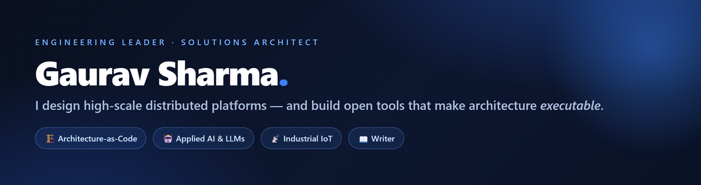
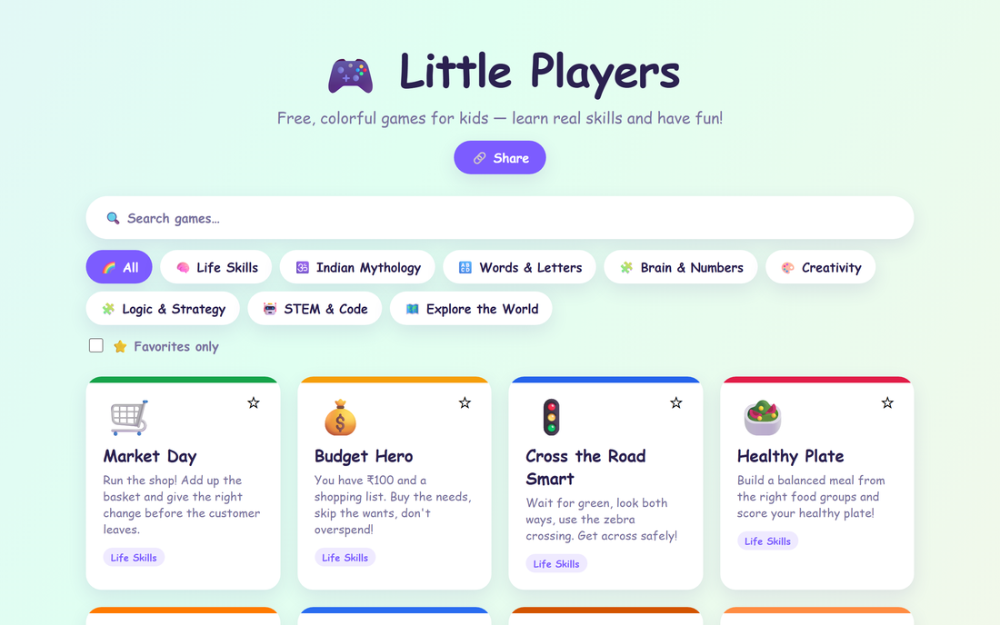

<!-- Profile README for github.com/gauravs19 -->

  

  I turn complex business objectives into resilient, high-scale platforms — and open-source the tools, blueprints, and playbooks I build along the way.
   I work where <b>enterprise architecture</b>, <b>agentic AI</b>, and <b>industrial-scale distributed systems</b> meet.

  
  
  

---

## ⭐ Featured

<table>
  <tr>
    <td width="44%">
      
    </td>
    <td width="56%" valign="top">
      <h3>Archpilot &nbsp;·&nbsp; ⭐ 8</h3>
      
An open-source <b>agentic pipeline</b> that turns a single requirement into deep discovery, EARS-compliant requirements, HLD, LLD, and a scored guardrail review — enforced by 36 enterprise rule files.

      

        <a href="https://gauravs19.github.io/archpilot/"><b>Live demo →</b></a> &nbsp;·&nbsp;
        <a href="https://github.com/gauravs19/archpilot">Repo</a>
         Python · LLM · Architecture-as-Code · works with Claude Code, Cursor, Copilot
      

    </td>
  </tr>
  <tr>
    <td width="44%">
      
    </td>
    <td width="56%" valign="top">
      <h3>CADEX</h3>
      
A free, browser-only <b>deal-qualification framework</b> for IT-consulting presales. Score risk across 8 axes, match an engagement strategy, and run a 42-point quality gate — in 25 minutes, no login, no data leaves your device.

      

        <a href="https://gauravs19.github.io/cadex/"><b>Live demo →</b></a> &nbsp;·&nbsp;
        <a href="https://github.com/gauravs19/cadex">Repo</a>
         React · TypeScript · Vite · Tailwind
      

    </td>
  </tr>
  <tr>
    <td width="44%">
      
    </td>
    <td width="56%" valign="top">
      <h3>pgvitals</h3>
      
40 copy-paste <b>PostgreSQL diagnostic queries</b> — one for every performance bottleneck — plus a 0–100 health score, a shareable HTML report, and optional AI analysis. No extensions. No install. Just SQL.

      

        <a href="https://pgvitals.github.io/"><b>Live demo →</b></a> &nbsp;·&nbsp;
        <a href="https://github.com/pgvitals/pgvitals">Repo</a>
         PL/pgSQL · DBA · performance diagnostics
      

    </td>
  </tr>
</table>

---

## 🔴 More live tools — click to try

<table>
  <tr align="center">
    <td width="25%"><a href="https://gauravs19.github.io/nfr-advisor/"> <b>NFR Advisor</b></a> Rank quality attributes &amp; trade-offs</td>
    <td width="25%"><a href="https://gauravs19.github.io/enterprise-architecture-skill/"> <b>EA Skill</b></a> C4 · ArchiMate · TOGAF · arc42</td>
    <td width="25%"><a href="https://gauravs19.github.io/iiot-reference-architecture/"> <b>IIoT Ref. Arch.</b></a> Industrial IoT blueprint</td>
    <td width="25%"><a href="https://littleplayers.github.io/"> <b>Little Players</b></a> 23 kids' learning games</td>
  </tr>
</table>

---

## 🧭 Explore by dimension

<b>🏗️ Architecture-as-Code &amp; Governance</b> — make architecture executable, not just advisory

| Project | What it does | |
|---|---|---|
| **[archpilot](https://github.com/gauravs19/archpilot)** ⭐8 | Agentic requirement → discovery → HLD/LLD → scored review pipeline | [demo](https://gauravs19.github.io/archpilot/) |
| **[archpilot-reviewer](https://github.com/gauravs19/archpilot-reviewer)** ⭐2 | Automated architecture governance on every pull request | — |
| **[archpilot-cli](https://github.com/gauravs19/archpilot-cli)** | Scaffold EA documents from the Archpilot standards library | — |
| **[enterprise-architecture-skill](https://github.com/gauravs19/enterprise-architecture-skill)** ⭐1 | C4 + Structurizr, ArchiMate, TOGAF ADM & arc42 as a Claude Code skill | [demo](https://gauravs19.github.io/enterprise-architecture-skill/) |
| **[nfr-advisor](https://github.com/gauravs19/nfr-advisor)** | Context → ranked NFRs → trade-offs → testable scenarios → as-code export | [demo](https://gauravs19.github.io/nfr-advisor/) |
| **[cadex](https://github.com/gauravs19/cadex)** | Deal-qualification & risk framework for presales | [demo](https://gauravs19.github.io/cadex/) |

<b>🤖 Applied AI &amp; ML</b> — building with AI, not just talking about it

| Project | What it does | |
|---|---|---|
| **[iiot-predictive-maintenance](https://github.com/gauravs19/iiot-predictive-maintenance)** | RUL prediction + failure classification + anomaly detection (PyTorch, AI4I & NASA C-MAPSS) | — |
| **[iiot-ai-rag](https://github.com/gauravs19/iiot-ai-rag)** | From-scratch RAG over manuals/FMEA + case-based RAG over sensor signatures | — |
| **[stockmarket-aggregator](https://github.com/gauravs19/stockmarket-aggregator)** | Financial-news sentiment, fully client-side via WebAssembly + Transformers.js | [demo](https://market-signals-pi.vercel.app) |
| **[claude-usage-monitor](https://github.com/gauravs19/claude-usage-monitor)** | VS Code extension: real-time Claude Code token & rate-limit telemetry | — |

<b>📐 Reference Architectures &amp; Blueprints</b> — production-grade patterns at scale

| Project | What it does | |
|---|---|---|
| **[iiot-reference-architecture](https://github.com/gauravs19/iiot-reference-architecture)** | Reference architecture for Industrial & Enterprise IoT platforms | [demo](https://gauravs19.github.io/iiot-reference-architecture/) |
| **[scale-first-ingestion](https://github.com/gauravs19/scale-first-ingestion)** | 100K+ concurrent-asset telemetry ingestion (distributed pipeline patterns) | — |
| **[scale-first-ingestion-java](https://github.com/gauravs19/scale-first-ingestion-java)** | Reactive Spring Boot 3.2 + Project Reactor twin | — |
| **[cloud-native-observability](https://github.com/gauravs19/cloud-native-observability)** | Vendor-neutral catalog of metrics, alerts, SLOs & an operating methodology | — |
| **[enterprise-solutioning-framework](https://github.com/gauravs19/enterprise-solutioning-framework)** | Methodology for architects leading IIoT, GenAI & digital transformations | — |

<b>📖 Writing, Playbooks &amp; Reading</b> — the thinking behind the building

| Resource | What it is |
|---|---|
| **[Tech Tradeoff](https://techtradeoff.substack.com/)** (Substack) | Deconstructing the hardest tradeoffs in enterprise architecture, distributed systems & technical leadership |
| **[presales-playbook](https://github.com/gauravs19/presales-playbook)** | The missing manual for technical sellers — discovery, deal orchestration & architecture defense ([read](https://gauravs19.github.io/presales-playbook/)) |
| **[cloud-native-observability](https://github.com/gauravs19/cloud-native-observability)** | Reference catalog you can read end-to-end before you instrument anything |
| **Curated lists** | [awesome-claude-skills](https://github.com/gauravs19/awesome-claude-skills) · [Awesome-LLMOps](https://github.com/gauravs19/Awesome-LLMOps) |

<b>🛠️ Developer Tools &amp; Utilities</b> — small, sharp, useful

| Project | What it does |
|---|---|
| **[viewer2pdf](https://github.com/gauravs19/viewer2pdf)** | Capture canvas/image document viewers (that block download/print) into a PDF — Node + Playwright |
| **[gs-hawk-terminal](https://github.com/gauravs19/gs-hawk-terminal)** | CLI for NSE stock-market research & signals |
| **[gs-theme](https://github.com/gauravs19/gs-theme)** | Zero-dependency GitHub Pages landing template (dark hero, 5 accent presets) |

<b>🎮 Built for fun — family &amp; learning</b>

| Project | What it is |
|---|---|
| **[Little Players](https://littleplayers.github.io/)** | A hub of 23 free, colorful learning games for kids across 8 categories ([org](https://github.com/LittlePlayers)) |
| **[LoungeGaming](https://github.com/cyoa/LoungeGaming)** | A browser-based, choose-your-own-adventure game app |

---

## 🧱 Tech I build with

  
  
  
  
  

  
  
  
  
  
  

  
  
  
  
  
  

---

  Tackling platform scaling, enterprise AI rollouts, or industrial IoT? &nbsp;
  <a href="https://www.linkedin.com/in/gauravs19/">Let's talk →</a>

